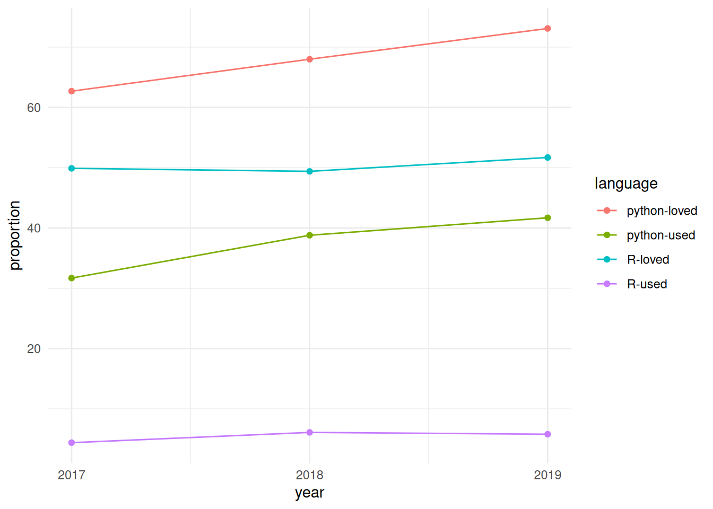

# 7  Appendices

## 7.1 Notes on Scope and the Python Statistical Ecosystem

Two factors may be usefully noted in this regard:

1.  The potential number of python packages for statistical analyses is likely to be relatively more restricted than relative numbers of **R** packages. Taking as indicative presentations at the previous three Joint Statistical Meetings (JSMs; 2018-2020), no python packages were referred to in any abstract, while 32 **R** packages were presented, along with two meta-platforms for **R** packages. Presentations at the Symposium of Data Science and Statistics (SDSS) for 2018-19 similarly including numerous presentations of **R** packages, along with presentation of [three](https://altair-viz.github.io) [python](https://github.com/ajboyd2/salmon) [packages](https://github.com/dlsun/symbulate). It may accordingly be expected that potential expansion to include python packages will demand relatively very little time or effort compared with that devoted to **R** packages as the primary software scope.
2.  In spite of the above, the community of python users is enormously greater, reflected in the currently 899,774 packages compared with 25,143 packages on CRAN, or over 35 times as many python packages. Similarly, 41.7% of all respondents to the [2019 stackoverflow developer survey](https://insights.stackoverflow.com/survey/2019) nominated python as their most popular language, compared with only 5.8% who nominated **R**.

The relative importance of python is powerfully reflected in temporal trends from the [stackoverflow developer survey](https://insights.stackoverflow.com/survey/2019) from the previous three years, with results shown in the following graphic.

Python is not only more used and more loved than **R**, but both statistics for python have consistently grown at a faster rate over the past three years as have equivalent statistics for **R**.

Both languages nevertheless have relative well-defined standards for software packaging, python via the [Python Package Index (pypi)](https://packaging.python.org/tutorials/packaging-projects), and **R** via [CRAN](https://cran.r-project.org). In contrast to CRAN, which runs its own checks on all packages on a daily basis, there are no automatic checks for [pypi](https://packaging.python.org/tutorials/packaging-projects) packages, and almost any form of package that minimally conforms to the standards may be submitted. This much lower effective barrier to entry likely partially contributes to the far greater numbers of [pypi](https://packaging.python.org/tutorials/packaging-projects) (899,774) than [CRAN](https://cran.r-project.org) (25,143) packages.

## 7.2 Empirical Derivation of Categories

We attempted to derive a realistic categorisation through using empirical data from several sources of potential software submissions, including all apparently “statistical” R packages published in the [Journal of Open Source Software (JOSS](https://joss.theoj.org)), packages published in the [Journal of Statistical Software](https://www.jstatsoft.org/index), software presented at the 2018 and 2019 Joint Statistical Meetings (JSM), and Symposia on Data Science and Statistics (SDSS), well as CRAN task views. We have also compiled a list of the descriptions of [all packages rejected by rOpenSci](https://github.com/mpadge/statistical-software/blob/master/abstracts/ropensci-abstracts.md) as being out of current scope because of current inability to consider statistical packages, along with a selection of [recent statistical R packages](https://github.com/mpadge/statistical-software/blob/master/abstracts/joss-abstracts.md) accepted by JOSS. (The full list of all R package published by JOSS can be viewed at <https://joss.theoj.org/papers//in/R>).

We allocated one or more key words (or phrases) to each abstract, and use the frequencies and inter-connections between these to inform the following categorisation are represented in the [interactive graphic](https://ropenscilabs.github.io/statistical-software/abstracts/network-terms/index.html) (also included in the [Appendix](#appendix-keywords)), itself derived from analyses of abstracts from all statistical software submitted to both rOpenSci and JOSS. (Several additional analyses and graphical representations of these raw data are included an [auxiliary github repository](https://github.com/ropenscilabs/statistical-software).) The primary nodes that emerge from these empirical analyses (with associated *relative* sizes in parentheses) are shown in the following table.

|   n | term                           | proportion |
|----:|:-------------------------------|-----------:|
|   1 | ML                             |      0.133 |
|   2 | statistical indices and scores |      0.111 |
|   3 | visualization                  |      0.111 |
|   4 | dimensionality reduction       |      0.100 |
|   5 | probability distributions      |      0.100 |
|   6 | regression                     |      0.100 |
|   7 | wrapper                        |      0.100 |
|   8 | estimates                      |      0.089 |
|   9 | Monte Carlo                    |      0.089 |
|  10 | Bayesian                       |      0.078 |
|  11 | categorical variables          |      0.078 |
|  12 | EDA                            |      0.078 |
|  13 | networks                       |      0.078 |
|  14 | summary statistics             |      0.067 |
|  15 | survival                       |      0.067 |
|  16 | workflow                       |      0.067 |

Most frequent key words from all JOSS abstracts (N = 92) for statistical software. Proportions are scaled *per abstract*, with each abstract generally having multiple key words, and so sum of proportions exceeds one. {.caption-top .table .table-sm .table-striped .small}

The top key words and their inter-relationships within the main [network diagram](https://ropenscilabs.github.io/statistical-software/abstracts/network-terms/index.html) were used to distinguish the following primary categories representing all terms which appear in over 5% of all abstracts, along with the two additional categories of “spatial” and “education”. We have excluded the key word “Estimates” as being too generic to usefully inform standards, and have also collected a few strongly-connected terms into single categories.

| n | term | proprtion | comment |
|---:|:---|---:|:---|
| 1 | Bayesian & Monte Carlo | 0.167 |  |
| 2 | dimensionality reduction & feature selection | 0.144 | Commonly as a result of ML algorithms |
| 3 | ML | 0.133 |  |
| 4 | regression/splines/interpolation | 0.133 | Including function data analysis |
| 5 | statistical indices and scores | 0.111 | Software generally intended to produce specific indices or scores as statistical output |
| 6 | visualization | 0.111 |  |
| 7 | probability distributions | 0.100 | Including kernel densities, likelihood estimates and estimators, and sampling routines |
| 8 | wrapper | 0.100 |  |
| 9 | Exploratory Data Analysis (EDA) | 0.078 | Including information statistics such as Akaike’s criterion, and techniques such as random forests. Often related to workflow software. |
| 10 | categorical variables | 0.078 | Including latent variables, and those output from ML algorithms. Note also that method for dimensionality reduction (such as clustering) often transform data to categorical forms. |
| 11 | networks | 0.078 |  |
| 12 | summary statistics | 0.067 | Primarily related in the empirical data to regression and survival analyses, yet clearly a distinct category of its own. |
| 13 | survival | 0.067 | strongly related to EDA, yet differing in being strictly descriptive of software *outputs* whereas EDA may include routines to explore data *inputs* and other pre-output stages of analysis. |
| 14 | workflow | 0.067 | Often related to EDA, and very commonly also to ML. |
| 15 | spatial | 0.033 | Also an important intermediate node connecting several other nodes, yet defining its own distinct cluster reflecting a distinct area of expertise. |
| 16 | education | 0.044 |  |

Proposed categorisation of statistical software, with corresponding proportions of all JOSS software matching each category {.caption-top .table .table-sm .table-striped .small}

The full network diagram can then be reduced down to these categories only, with interconnections weighted by all first- and second-order interconnections between intermediate categories, to give the following, simplified diagram (in which “scores” denotes “statistical indices and scores”; with the diagram best inspected by dragging individual nodes to see their connections to others).

    Warning: `clusters()` was deprecated in igraph 2.0.0.
    ℹ Please use `components()` instead.

Standards considered under any of the ensuing categories must be developed with reference to inter-relationships between categories, and in particular to potential ambiguity within and between any categorisation. An example of such ambiguity, and of potential difficulties associated with categorisation, is the category of “network” software which appropriate describes the [`grapherator`](https://github.com/jakobbossek/grapherator) package (with accompanying [JOSS paper](https://joss.theoj.org/papers/10.21105/joss.00528)) which is effectively a distribution generator for data represented in a particular format that happens to represent a graph; and three JSM presentations, one on [network-based clustering of high-dimensional data](https://ww2.amstat.org/meetings/jsm/2018/onlineprogram/AbstractDetails.cfm?abstractid=327171), one on [community structure in dynamic networks](https://ww2.amstat.org/meetings/jsm/2018/onlineprogram/AbstractDetails.cfm?abstractid=328764) and one on [Gaussian graphical models](https://ww2.amstat.org/meetings/jsm/2018/onlineprogram/AbstractDetails.cfm?abstractid=328764). Standards derived for network software must accommodate such diversity of applications, and must accommodate software for which the “network” category may pertain only to some relatively minor aspect, while the primary algorithms or routines may not be related to network software in any direct way.

## 7.3 Analysis of statistical software keywords

The [JOSS](https://joss.theoj.org) conducts its own peer review process, and publishes textual descriptions of accepted software. Each piece of software then has its own web page on the journal’s site, on which the text is presented as a compiled `.pdf`-format document, along with links to the open review, as well as to the software repository. The published document must be included within the software repository in a file named `paper.md`, which enables automatic extraction and analysis of these text descriptions of software. Rather than attempt a comprehensive, and unavoidably subjective, categorization of software, these textual descriptions were used to identify key words or phrases (hereafter, “keywords”) which encapsulated the purpose, function, or other general descriptive elements of each piece of software. Each paper generally yielded multiple keywords. Extracting these from all papers judged to be potentially in scope allowed for the construction of a network of topics, in which the nodes were the key words and phrases, and the connections between any pair of nodes reflected the number of times those two keywords co-occurred across all papers.

We extracted all papers accepted and published by JOSS (217 at the time of writing in early 2020), and manually determined which of these were broadly statistical, reducing the total to 92. We then read through the contents of each of these, and recorded as many keywords as possible for each paper. The resultant network is shown in the following interactive graphic, in which nodes are scaled by numbers of occurrences, and edges by numbers of co-occurrences. (Or [click here](https://ropenscilabs.github.io/statistical-software/abstracts/network-terms/index.html) for full-screen version with link to code.)

Such a network visualization enables immediate identification of more and less central concepts including, in our case, several that we may not otherwise have conceived of as having been potentially in scope. We then used this network to define our set of key “in scope” concepts. This figure also reveals that many of these keywords are somewhat “lower level” than the kinds of concepts we might otherwise have used to define scoping categories. For example, keywords such as “likelihood” or “probability” are not likely to be useful in defining actual categories of statistical software, yet they turned out to lie at the centres of relatively well-defined groups of related keywords.

We also examined the forms of both input and output data for each of the 92 pieces of software described in these JOSS papers, and constructed [an additional graph](https://ropenscilabs.github.io/statistical-software/abstracts/network-io/index.html) directionally relating these different data formats.

## 7.4 Other Software Standards

Among the noteworthy instances of software standards, the following are particularly relevant:

1.  The [Core Infrastructure Initiative’s Best Practices Badge](https://bestpractices.coreinfrastructure.org/en), which is granted to software meeting an extensive list of [criteria](https://github.com/coreinfrastructure/best-practices-badge/blob/master/doc/criteria.md). This list of criteria provides a singularly useful reference for software standards.
2.  The [Software Sustainability Institute](https://www.software.ac.uk/)’s [*Software Evaluation Guide*](https://www.software.ac.uk/resources/guides-everything/software-evaluation-guide), in particular their guide to [*Criteria-based software evaluation*](http://software.ac.uk/sites/default/files/SSI-SoftwareEvaluationCriteria.pdf), which considers two primary categories of *Usability* and *Sustainability and Maintainability*, each of which is divided into numerous sub-categories. The guide identifies numerous concrete criteria for each sub-category, explicitly detailed below in order to provide an example of the kind of standards that might be adapted and developed for application to the present project.
3.  The [*Transparent Statistics Guidelines*](https://transparentstats.github.io/guidelines/), by the “HCI (Human Computer Interaction) Working Group”. While currently only in its beginning phases, that document aims to provide concrete guidance on “transparent statistical communication.” If its development continues, it is likely to provide useful guidelines on best practices for how statistical software produces and reports results.
4.  The more technical considerations of the [Object Management Group](https://www.omg.org/index.htm)’s [*Automated Source Code CISQ Maintainability Measure*](https://www.omg.org/spec/ASCMM/) (where CISQ refers to the [*Consortium for IT Software Quality*](https://www.it-cisq.org/)). This guide describes a number of measures which can be automatically extracted and used to quantify the maintainability of source code. None of these measures are not already considered in one or both of the preceding two documents, but the identification of measures particularly amenable to automated assessment provides a particularly useful reference.

There is also rOpenSci’s guide on [package development, maintenance, and peer review](https://devguide.ropensci.org/), which provides standards of this type for R packages, primarily within its first chapter. Another notable example is the [tidyverse design guide](https://principles.tidyverse.org/), and the section on [Conventions for R Modeling Packages](https://tidymodels.github.io/model-implementation-principles/) which provides guidance for model-fitting APIs.

Specific standards for neural network algorithms have also been developed as part of a [google 2019 Summer Of Code project](http://www.inmodelia.com/gsoc2019.html), resulting in a dedicated R package, [`NNbenchmark`](https://akshajverma.com/NNbenchmarkWeb/index.html), and accompanying results—their so-called [“notebooks”](https://akshajverma.com/NNbenchmarkWeb/notebooks.html)—of applying their benchmarks to a suite of neural network packages.

## 7.5 Bibliography

# 8 Review request template

Editors may make use of the e-mail template below in recruiting reviewers.

Dear \[REVIEWER\]

Hi, this is \[EDITOR\]. \[FRIENDLY BANTER\]. I’m writing to ask if you would be willing to review a R package for rOpenSci. As you may know, rOpenSci conducts peer review of R packages contributed to our collection in a manner similar to journals. We have recently expanded our scope from data-management packages include packages implementing statistical algorithms, and this package is one of these.

The package, \[PACKAGE\] by \[AUTHOR(S)\], does \[FUNCTION\]. You can find it on GitHub here: \[REPO LINK\]. We conduct our open review process via GitHub as well, here: \[SOFTWARE-REVIEW ISSUE\]. In that GitHub discussion thread you will find the results of automated package checks, and summaries of package code structure, as well.

If you accept, note that while we generally ask reviewers to complete reviews in three weeks, this program is still in pilot mode, and review times for statistical software are flexible. We’re also eager to hear feedback from reviewers on the general process.

Our guidance for reviewing statistical packages at https://stats-devguide.ropensci.org/pkgreview.html. Our standards for statistical packages are detailed at https://stats-devguide.ropensci.org/standards.html. Note that packages must comply with both the general standards, and at least one specific category of statistical standards. This package falls under the \[CATEGORY\] category. The automated checks in the GitHub issue thread include a link to a report of how authors have complied with our standards by annotating their code. We hope this will aid your review. There’s a template for reviewers at the end of the reviewers’ guide (https://stats-devguide.ropensci.org/pkgreview.html).

Please make sure you do not have a [conflict of interest](https://devguide.ropensci.org/policies.html#coi) preventing you from reviewing this package. If you have questions or feedback, feel free to ask me or post to the [rOpenSci forum](https://discuss.ropensci.org/). If you accept, we also invite you to join the rOpenSci Slack channel.

Are you able to review? If you can not, suggestions for alternate reviewers are always helpful. If I don’t hear from you within a week, I will assume you are unable to review at this time.

Thank you for your time.

Sincerely,

\[EDITOR\]

# 9 Book release guidance

Versions of this book are represented in corresponding version numbers of the *Statistical Software Review* badges which appear on peer-reviewed repositories. Maintaining this synchronisation between versions of this book and peer-review badges requires the following steps to be following for each release of this book.

1.  Increment version number in the repository’s “DESCRIPTION” file. Releases require an increment in at least the minor version number, so for example from 0.1 to 0.2.
2.  Create new badges in [the `svgs` directory of `ropensci-org/badges`](https://github.com/ropensci-org/badges/tree/main/svgs) by copying existing versions, and updating the text for the version numbers. These should only have major and minor versions, “XX.YY”. Commit and push changes to that repository. An example of such an update can be seen in [this commit](https://github.com/ropensci-org/badges/commit/2c9ef4bfce7a81a8d633ce2a9b6b2f1766d43830).
3.  Ensure that corresponding issue labels exist on [the main `software-review` repository](https://github.com/ropensci/software-review/labels), or create issue labels with new version numbers if they don’t exist.

Approving a package will then automatically add the badge for the corresponding stats grade, along with the latest version number. All other processes within the `ropensci-review-bot` rely on the external endpoint, `stats_badge`, defined [by the `stats_badge()` function in `ropensci-review-tools/roreviewapi`](https://github.com/ropensci-review-tools/roreviewapi/blob/main/R/srr.R). That function reads the version from the badge at the time of approval, or defaults to the latest version for packages still under review and not yet approved.
