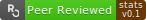
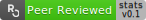
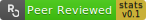

#  (PART) Package Development, Submission, and Review {-}


# Guide for Authors {#pkgdev}

The current chapter should be considered an extension of the corresponding
["Guide for Authors"](https://devguide.ropensci.org/guide-for-authors.html) in
rOpenSci's "Dev Guide". The principles for package development described there
also apply to statistical packages, with this chapter describing additional
processes and practices for packages intended for submission to the statistical
software peer review system.

The major additional process is the documentation of how a package complies
with the general and category-specific standards given in [Chapter
6](#standards). Authors need to document within the software itself every point
at which it complies with every general and every applicable category-specific
standard listed in that chapter. The process of doing so is facilitated by the
[`srr` package](https://github.com/ropensci-review-tools/srr), as described in
detail in [Sub-section 3.4, below](#pkgdev-srr).

Documenting compliance with our standards will generally entail more work than
for non-statistical software submitted to our general peer review system. The
first of the following sub-sections thus presents some of the benefits
authors may expect from submitting their statistical software for peer-review.

The chapter then proceeds with a description of the scope of statistical
software able to be considered for review, followed by descriptions of two
tools intended to be used through the entire process of package development.
The first tool is the [`pkgcheck`
package](https://github.com/ropensci-review-tools/pkgcheck) which should be used
to confirm whether software is ready for submission or not, and enables authors
to locally run the suite of checks which are automatically run on package
submission. The subsequent sub-section describes our [`autotest`
tool](https://github.com/ropensci-review-tools/autotest), which is intended to
be used through the entire process of package development. The third
sub-section describes how use the [`srr`
package](https://github.com/ropensci-review-tools/srr) to address the major
task of aligning software with our [general and category-specific
standards](#standards) for statistical software, and the final sub-section
describes the final step of specifying which grade of badge authors are aiming
for.

## Benefits of statistical software peer review

- First, feedback from your reviewers and editors will increase the quality and
  usability of your software. Both authors and reviewers consistently report
  that review improves code and makes them better programmers through the
  feedback and interaction with each other.
- Bringing your software into compliance with our standards will make your
  software easier to maintain, as many of our standards, such as those for
  testing and continuous integration, are designed to make sure software
  continues to function well as it is updated.
- As our standards and peer-review process aim to improve the quality and
  completeness of documentation, going through peer-review should make your
  software more understandable and reduce the support you need to provide to
  users.
- Approval by rOpenSci will make it easier to submit your software to
  repositories and journals. Packages approved by rOpenSci generally are
  CRAN-ready. They are eligible for expedited review at the [*Journal of Open
  Source Software*](https://joss.theoj.org/), and the [*Journal of Statistical
  Software* (JStatSoft)](https://www.jstatsoft.org/index) already [recommends
  that developers refer to our standards](https://www.jstatsoft.org/authors).
  In our experience code peer-review is looked on favorably by reviewers of
  software papers at many journals. 
- In regulated environments and other fields where strong demonstration of
  quality and compliance is needed, approval by peer-review provides strong
  evidence of software quality rarely available for statistical software. Our
  approach to annotating _within code_ how software meets standards makes
  demonstration of compliance clear and granular. We are actively working with
  the [R Validation Hub](https://pharmar.org) to make approval under our system
  of review and standards a component of validation in regulated environments
  such as pharmaceutical or clinical research.

## Scope

The first important task prior to submitting a package is to estimate whether
a package is likely to be considered within our scope for statistical software.
As described in the [Overview](#overview-scope), packages are generally
considered in scope if they fit one or more of the [categories listed
there](#overview-categories). Prior to submission, authors must choose one
or more of these categories, and document how their software aligns with the
corresponding standards given in [Chapter 6](#standards), according to the
procedures [described below](#pkgdev-srr). Any software which can be aligned
with one or more sets of category-specific standards will by definition be
considered in scope.

Authors are encouraged to contact us at any point prior to, or during,
development, to ask about whether a package might be in scope, or which
categories it might fit within. Categorisation of packages may not always be
straightforward, and we particularly encourage authors who are unsure about
whether a package belongs in a particular category or not to contact us for
discussion. An initial judgement of whether or not a package belongs in
a particular category may be gained by examining the respective standards. Any
package for which a large number of standards from a particular category may be
considered applicable (regardless of whether or not they would actually be
checked) is likely to fit within that category. Once you have determined that
your package is likely to fit into one or more of our in-scope categories,
you'll need to apply our three primary development tools described in the
following two sub-sections.

## The [`pkgcheck` package](https://github.com/ropensci-review-tools/pkgcheck)

The [`pkgcheck` package](https://github.com/ropensci-review-tools/pkgcheck) can
be used to confirm whether software is ready for submission or not. The checks
implemented within this package are also automatically run upon submission, and
packages are expected to successfully pass all checks prior to initial
submission. Packages may only be submitted once the main [`pkgcheck()`
function](hThe://ropensci-review-tools.github.io/pkgcheck/reference/pkgcheck.html)
indicates such, through clearly stating,

> *This package may be submitted*

This function accepts a single argument of the local path to
the package being checked, and returns a detailed list of checks and associated
results. The return object has a `summary` method which prints a formatted
result to the console indicating whether a package is ready for
submission or not. See the main [package
website](https://github.com/ropensci-review-tools/pkgcheck) for more details.

The [`pkgcheck()`
function](hThe://ropensci-review-tools.github.io/pkgcheck/reference/pkgcheck.html)
is also applied to all packages upon initial submission, in response to which
our `ropensci-review-bot` will print the results in the issue. In the unlikely
circumstances that a package is unable to pass particular checks, explanations
should be given upon submission about why those checks fail, and why review may
proceed in spite of such failures.

An example result of the [`pkgcheck()`
function](hThe://ropensci-review-tools.github.io/pkgcheck/reference/pkgcheck.html)
may be seen by applying it to the skeleton [`srr` (**S**oftware **R**eview
**R**oclets) package](https://github.com/ropensci-review-tools/srr):

```{r pkgcheck-srr, eval = FALSE, echo = TRUE}
path <- srr::srr_stats_pkg_skeleton ()
checks <- pkgcheck::pkgcheck (path)
summary (checks)
```
```{r pgkcheck-srr-output, echo = FALSE, eval = TRUE, collapse = TRUE}
cli::cli_h1 ("demo 0.0.0.9000")
cli::cli_text ("")
cli::cli_alert_success ("Package uses 'roxygen2'")
cli::cli_alert_danger ("Package does not have a 'contributing.md' file")
cli::cli_alert_danger ("Package does not have a 'CITATION' file")
cli::cli_alert_danger ("Package does not have a 'codemeta.json' file")
cli::cli_alert_success ("All functions have examples")
cli::cli_alert_danger ("Package 'DESCRIPTION' does not have a URL field")
cli::cli_alert_danger ("Package 'DESCRIPTION' does not have a BugReports field")
cli::cli_alert_success ("Package name is available")
cli::cli_alert_danger ("Package has no continuous integration checks")
cli::cli_alert_danger ("Package coverage is 0% (should be at least 75%)")
cli::cli_alert_success ("R CMD check found no errors")
cli::cli_alert_success ("R CMD check found no warnings")
cli::cli_alert_danger ("This package still has TODO standards and can not be submitted")
cli::cli_text ("")
cli::cli_alert_info ("Current status:")
cli::cli_alert_danger ("This package is not ready to be submitted")
```


## The [`autotest` package](https://github.com/ropensci-review-tools/autotest) {#pkgdev-autotest}

The [`autotest` package](https://github.com/ropensci-review-tools/autotest) is
an automated assessment tool which all packages are expected to pass in order
to be accepted for submission. The package implements a form of "mutation
testing," by examining the types of all input parameters, implementing
type-specific mutations, and examining the response of each function in
a package to all such mutations. This kind of mutation testing is a very
effective way to uncover any unexpected behaviour which authors themselves
might not necessarily pre-empt. The purpose of using
[`autotest`](https://github.com/ropensci-review-tools/autotest) to prepare
packages is to avoid as much as possible the common situation of reviewers
discovering bugs when they attempt to use software in ways that differ from
typical uses envisioned by authors themselves. Reviews of software prepared
with the help of
[`autotest`](https://github.com/ropensci-review-tools/autotest) should be less
burdened by discussions of what are often minor technical details, and more
able to focus on "higher level" aspects of software quality.


Full documentation of how to use
[`autotest`](https://github.com/ropensci-review-tools/autotest) in package
development is provided on the [package
website](https://ropensci-review-tools.github.io/autotest/), and we
particularly encourage any authors intending to develop packages for submission
to our peer review system to step through the [main `autotest`
vignette](https://ropensci-review-tools.github.io/autotest/articles/autotest.html),
and to apply [`autotest`](https://ropensci-review-tools.github.io/autotest/)
continuously throughout package development, to ensure that
[`autotest_package()`](https://ropensci-review-tools.github.io/autotest/reference/autotest_package.html)
returns clean (`NULL`) results when the package is first submitted.


## The [`srr` package](https://github.com/ropensci-review-tools/srr) {#pkgdev-srr}

Once a package has been sufficiently developed to begin alignment with our
standards, and once all issues revealed by
[`autotest`](https://ropensci-review-tools.github.io/autotest/) have been
addressed, authors will need to use our third tool, the [`ssr` (**s**oftware
**r**eveiw **r**oclets) package](https://ropensci-review-tools.github.io/srr/)
to insert both general and category-specific standards into their code, and to
begin the process of documenting within the code itself how and where the code
adheres to the individual standards. The [`srr`
package](https://ropensci-review-tools.github.io/srr/) can be installed locally
by running either one of the following two lines.

```{r srr-install-dev, eval = FALSE, echo = TRUE}
remotes::install_github("ropensci-review-tools/srr")
pak::pkg_install("ropensci-review-tools/srr")
```

`srr` procedures are described in detail on the [package
website](https://ropensci-review-tools.github.io/srr/), and in particular in
the [main
vignette](https://ropensci-review-tools.github.io/srr/articles/srr-stats.html).
Authors are first encouraged to obtain a local copy of the [source code for
that
vignette](https://github.com/ropensci-review-tools/srr/blob/main/vignettes/srr-stats.Rmd),
and to step through each line in order to understand how the procedure works.
Having done that, you may then insert standards into your own package by
running the following line from within the local directory of your package,

```{r ssr-standards, eval = FALSE, echo = TRUE}
srr_stats_roxygen (category = c ("<category-1>", "<category-2>"))
```

That will insert a new file into the `R/` directory of your package called (by
default) `srr-stats-standards.R`. All standards initially have
a [`roxygen2`](https://roxygen2.r-lib.org) tag of `@srrstatsTODO`, to indicate
that these standards are yet to be addressed. These tags are processed by the 
[`srr` roclet](https://ropensci-review-tools.github.io/srr/) which needs to be
connected with your package by modifying the `Roxygen` line of your
`DESCRIPTION` file to the following form:

```{r srr-DESC, eval = FALSE, echo = TRUE}
Roxygen: list (markdown = TRUE, roclets = c ("namespace", "rd", "srr::srr_stats_roclet"))
```

You do not need to add the `srr` package anywhere else in your `DESCRIPTION`
file, nor do you need to retain this line when submitting packages to CRAN (or
elsewhere). You should nevertheless retain the line at all other times, and you
can easily disable the roclet output by including `#' @srrVerbose FALSE`
somewhere within your documentation. Note that `srr` documentation lines are
used only to produce on-screen output triggered by running
[`roxygen2::roxygensise()`](https://roxygen2.r-lib.org/reference/roxygenize.html),
or the equivalent function,
[`devtools::document()`](http://devtools.r-lib.org/reference/document.html),
and do not appear in actual package documentation.

The [`srr` roclet](https://ropensci-review-tools.github.io/srr/) recognises and
process three tags:

1. `@srrstatsTODO` to flag standards yet to be addressed;
2. `@srrstats` to flag standards which have been addressed, and followed by
   descriptions of how your code addresses those standards; and
3. `@srrstatsNA` to flag standards which you deem not to be applicable to your
   code, followed by explanations of why you deem those standards not
   applicable.

The file generated by
[`srr_stats_roxygen()`](https://ropensci-review-tools.github.io/srr/reference/srr_stats_roxygen.html)
initially contains two [`roxygen2`](https://roxygen2.r-lib.org) blocks, the
first containing every standard potentially applicable to your package, tagged
with `@srrstatsTODO`, and the second with a title of `NA_standards`, to
document standards deemed not applicable. The first task after having generated
this file is to move standards to approximate locations within your package
where they are likely to be addressed. For example, standards concerning tests
should be moved somewhere within the `tests/` directory, standards concerning
documentation to the main `README.Rmd` file, or within a vignette file. The
[package
skeleton](https://ropensci-review-tools.github.io/srr/reference/srr_stats_pkg_skeleton.html)
includes code demonstrating how to include roclet tags within `.Rmd` files.

Moving different standards to more appropriate locations within your code will
break down an initially large single list of standards into more manageable
groups dispersed throughout your code. As each standard is addressed, it should
be moved to one or more locations in your code as near as possible to relevant
code, the tag changed from `@srrstatsTODO` to `@srrstats`, and a brief
description appended to explain how that standard is addressed. Standards
deemed not to be applicable to your package should all be grouped together
within a single [`roxygen2`](https://roxygen2.r-lib.org) block with a title of
`NA_standards`, each with a tag of `@srrstatsNA`, and a brief description of
why those standards are deemed not to be applicable.

Software to be submitted for review must contain no `@srrstatsTODO` tags --
that is, all standards must have been addressed by modifying every tag to
either `@srrstats` or `@srrstatsNA`, as described above. Two useful functions
to aid package alignment with standards are:

1. The [`srr_stats_pre_submit()`
   function](https://ropensci-review-tools.github.io/srr/reference/srr_stats_pre_submit.html),
   which confirms that all standards have been addressed prior to submission.
2. The [`srr_report()`
   function](https://ropensci-review-tools.github.io/srr/reference/srr_report.html),
   which generates a summary report with hyperlinks to locations within your
   code at which all standards are placed.

The output of both of these functions are included in the result of the
[`pkgcheck()`
function](hThe://ropensci-review-tools.github.io/pkgcheck/reference/pkgcheck.html),
both when run locally, and as run upon initial package submission.  The
[`srr_stats_pre_submit()`
function](https://ropensci-review-tools.github.io/srr/reference/srr_stats_pre_submit.html)
can be used locally to confirm that,

```{r pre-submit-success, echo = FALSE}
cli::cli_alert_success ("All applicable standards have been documented in this package")
```

while the result of the [`srr_report()`
function](https://ropensci-review-tools.github.io/srr/reference/srr_report.html)
may be accessed through the link given in the `pkgcheck` output, or it can be
viewed by calling that function directly.


## Gold, Silver, and Bronze Badges {#pkgdev-badges}

All statistical software which is recommended for acceptance by reviewers is
entitled to display an rOpenSci badge. This badge is a modified version of the
badge for the [current peer-review
system](https://devguide.ropensci.org/building.html#readme), with an additional
section on the far right indicating the version of that standards against which
the software was assessed, coloured according to the "grade" of the badge. The
three possible badges look like this:

[](https://github.com/ropensci/statistical-software-review-book)
**bronze** for software which is sufficiently or minimally compliant with
standards to pass review.

[](https://github.com/ropensci/statistical-software-review-book)
**silver** for software for which complies with more than a minimal set of
applicable standards, and which extends beyond bronze in least one notable way,
as explained below.

[](https://github.com/ropensci/statistical-software-review-book)
**gold** for software which complies with *all* standards which reviewers have
deemed potentially applicable.

The [submission
template](https://github.com/ropensci/software-review/blob/master/.github/ISSUE_TEMPLATE/F-submit-statistical-software-for-review.md)
for statistical software submissions requires authors to identify the grade
they wish to attain from the review process. These standards are not static,
and it is always possible to elevate a badge to a higher grade subsequent to
review. Badge grades may also be downgraded for code which is not continuously
aligned with ongoing developments in standards. The following sub-sections
provide further clarification of each grade.

### Bronze [](https://github.com/ropensci/statistical-software-review-book) {#pkgdev-bronze}

Software which is sufficiently or minimally compliant with standards will
receive a bronze badge. One common reason for this badge is software which
authors do not intend to develop further following review. This commonly
arises for software produced from research projects which have been completed,
leaving no funding to further develop the software. Another reason might be
that software has been developed for a particular use case, with authors
unable to align it with additional standards in order to expand its general
utility. A bronze badge need not signify any weakness or inadequacy in
software, rather it will generally signify software which has been developed
for one particular use case, and which will not be subject to significant
further development.

### Silver [](https://github.com/ropensci/statistical-software-review-book) {#pkgdev-silver}

Silver badges are granted to software which extends beyond the minimal
requirements of bronze in at least one the following four aspects:

- Compliance with a good number of standards beyond those identified as
  minimally necessary. This will require reviewers and authors to agree on
  identification of both a minimal subset of necessary standards, and a full
  set of potentially applicable standards. This aspect may be considered
  fulfilled if at least one quarter of the additional potentially applicable
  standards have been met, and should definitely be considered fulfilled if
  more than one half have been met.
- Demonstrating excellence in compliance with multiple standards from at least
  two broad sub-categories. Sub-categories are distinguished in the [Standards
  Chapter](#standards) by three numbers, so that the [*General
  Standards*](#general-standards) have five sub-categories numbered 6.1.1 to
  6.1.5. This aspect would require software to extend notably beyond the
  requirements of two or more standards in at least two sub-categories
  (regardless of whether general or category-specific standards). For example,
  software which might otherwise be assessed at bronze grade, yet which is both
  excellently documented, and has an outstanding test suite, may be considered
  to fulfil this aspect.
- Have a demonstrated *generality* of usage beyond one single envisioned use
  case. Software is frequently developed for one particular use case envisioned
  by the authors themselves. Generalising the utility of software so that it
  is readily applicable to other use cases, and satisfactorily documenting such
  generality of usage, represents another aspect which may be considered
  sufficient for software to attain a silver grade.
- Internal aspects of package structure and design. Many aspects of the
  internal structure and design of software are too variable to be effectively
  addressed by standards. Packages which are judged by reviewers to reflect
  notably excellent design choices, especially in the implementation of core
  statistical algorithms, may also be considered worthy of a silver grade.


### Gold [](https://github.com/ropensci/statistical-software-review-book) {#pkgdev-gold}

To attain a gold badge, software must comply with all applicable standards, and
must also fulfil at least three of the four aspects described above for
silver-grade badges. Both the applicability of standards, and fulfilment of
these three aspects, will ultimately determined by reviewers. Moreover,
compliance with all grades is assessed against current standards, meaning that
a gold badge must be actively maintained as standards themselves are revised
and updated.
